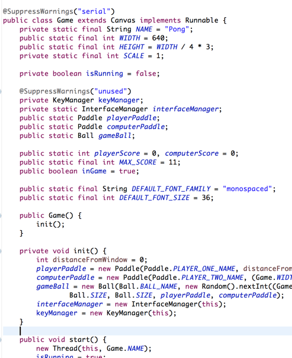

# Pong [Java]

## About

Pong is a two-dimensional sports game that simulates table tennis. The player controls an in-game paddle by moving it vertically across the left side of the screen, and can compete against either a computer-controlled opponent or another player controlling a second paddle on the opposing side. Players use the paddles to hit a ball back and forth. The aim is for each player to reach eleven points before the opponent; points are earned when one fails to return the ball to the other.

## Install

In order to start playing this game, you will need to clone/download it to your machine.
